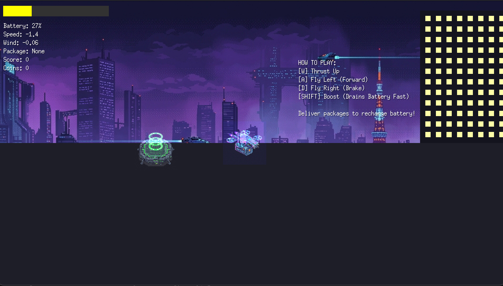

# Drone Delivery Rush 🚁📦

### "Every Second Counts. Every Gram Matters."

**Drone Delivery Rush** is a fast-paced 2D arcade game built with Go and Ebitengine. You control a futuristic delivery drone navigating through a dense, procedurally generated cyberpunk city. Your mission is to pick up heavy packages from rooftop landing pads and deliver them safely to drop-off zones while battling gravity, wind, and your own drone's battery limit.



## Features 🌟

- **Realistic Physics:** Your drone's weight dynamically changes when carrying a package, affecting acceleration and maneuverability.
- **Dynamic Weather:** Procedural wind gusts push your drone around, requiring constant correction.
- **Procedural Generation:** The city skyline generates infinitely to the left. The further you fly, the narrower the gaps and the taller the buildings become.
- **Forgiving Collisions:** A dual-hitbox system allows for thrilling "near misses" while ensuring direct hits into buildings or antennas result in a crash.
- **Cyberpunk Aesthetics:** High-contrast neon pixel art against a dark, moody cityscape.

## How to Play 🎮

You start on a safe landing pad on the right side of the city. You must fly **LEFT** into the endless cityscape.

- Fly into **Yellow Holographic Rings** to pick up a package. (Your drone will become heavier and slower!)
- Fly into **Green Holographic Rings** to deliver the package and earn points.
- **Avoid** crashing into the grey buildings or the tall radio antennas. 

### Controls

*   **`W`** - Boost Upwards (Consumes Battery)
*   **`A`** - Fly Left (Forward)
*   **`D`** - Fly Right (Backward/Brake)
*   **`ENTER`** - Start Game / Restart after crash
*   **`ESC`** - Return to Title Screen

## Installation & Running 🚀

This game is written in Go using the [Ebitengine](https://ebitengine.org/) 2D game library.

### Prerequisites
- [Go 1.18 or higher](https://go.dev/doc/install)
- A C compiler (required by Ebitengine for certain platforms)

### Running Locally
1. Clone or download this repository.
2. Open your terminal and navigate to the project folder.
3. Run the following command:
   ```bash
   go run .
   ```

## Architecture 🏗️

- **`main.go`**: Initializes the Ebitengine window and starts the core game loop.
- **`game/`**: Contains the Scene Manager (`game.go`), the Title Screen (`title_scene.go`), and the main gameplay loop (`game_scene.go`).
- **`entities/`**: Contains the physical objects of the game (`drone.go`, `obstacle.go`).
- **`systems/`**: Contains the procedural generation logic (`spawner.go`).
- **`assets/`**: Contains the images and the `assets.go` script for loading them into VRAM.

## Credits
- Built as an MVP Concept using Go & Ebitengine.
- Pixel Art generated via AI.
